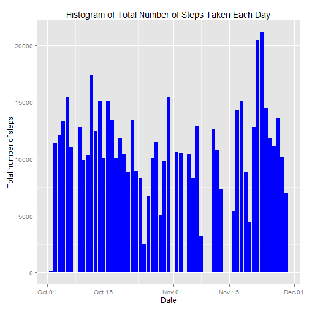
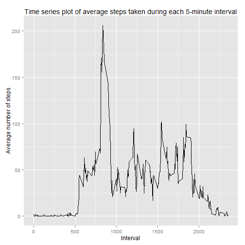
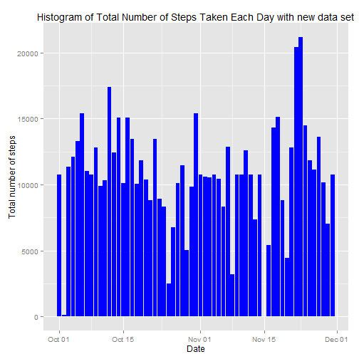
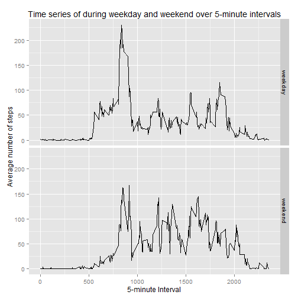

##Loading required libraries and settings

```r
require(dplyr)
require(ggplot2)
echo = TRUE
options(scipen = 1)
```
    
## Loading and preprocessing the data
    

```r
##unzip("activity.zip")

##load csv file
data<- read.csv('activity.csv', header = TRUE, sep =)
```

```
## Warning in file(file, "rt"): cannot open file 'activity.csv': No such file
## or directory
```

```
## Error in file(file, "rt"): cannot open the connection
```

```r
##Transform date from factor to date
data$date <- as.Date(data$date)

## Remove NA
data1 <- data[!is.na(data$steps),]
```

## What is mean total number of steps taken per day?

###1. Total number of steps taken each day

```r
totalSteps <- data1 %>%
    group_by(date) %>%
    summarise(total = sum(steps))

head(totalSteps)
```

```
## Source: local data frame [6 x 2]
## 
##         date total
##       (date) (int)
## 1 2012-10-02   126
## 2 2012-10-03 11352
## 3 2012-10-04 12116
## 4 2012-10-05 13294
## 5 2012-10-06 15420
## 6 2012-10-07 11015
```

###2. Histogram of steps taken per day

```r
ggplot(totalSteps, aes(x = date, y = total)) +  
    geom_bar(stat = "identity", fill = 'blue') +
    labs(title = "Histogram of Total Number of Steps Taken Each Day", x = "Date", y = "Total number of steps")
```

 

###3. Calculate mean and mediam total number of steps per day.

```r
mean <- mean(totalSteps$total)
median <-median(totalSteps$total)
```
####Mean = 10766.1886792

####Median = 10765
    
    
## What is the average daily activity pattern?
### 1. Make a time series plot of the 5-minute interval (x-axis) and the average number of steps taken, averaged across all days (y-axis)

```r
avgStepPerInterval <- data1 %>%
    group_by(interval) %>%
    summarise(average = mean(steps))

ggplot(avgStepPerInterval, aes(x = interval, y = average)) +
    geom_line(stat = "identity") + 
    labs(title = "Time series plot of average steps taken during each 5-minute interval"
         , x = "Interval", y = "Average number of steps")
```

 

###2. Which 5-minute interval, on average across all the days in the dataset, contains the maximum number of steps?

```r
maxinterval <- avgStepPerInterval$interval[avgStepPerInterval$average == max(avgStepPerInterval$average)]
```
#### Maximum number of steps occured during interval 835

## Imputing missing values
### There are a number of days/intervals where there are missing values (coded as NA). The presence of missing days may introduce bias into some calculations or summaries of the data.

### 1. Calculate and report the total number of missing values in the dataset (i.e. the total number of rows with NAs)


```r
missingNA <- sum(is.na(data))
```
#### There are 2304 missing values in the original data set

### 2. Devise a strategy for filling in all of the missing values in the dataset. The strategy does not need to be sophisticated. For example, you could use the mean/median for that day, or the mean for that 5-minute interval, etc.

####  The strategy I will be taking to fill in the missing values is to subsitute the NA values with the equivalent mean number of steps for that given 5-minute interval.

### 3. Create a new dataset that is equal to the original dataset but with the missing data filled in.


```r
## Create a copy of the original data  
data2 <- data

##for each row in the new data set, check if it is NA, if yes, get the corresponding entry from the average step for that interval
for (i in 1:nrow(data2)) {
    if(is.na(data2$steps[i])) {
        data2$steps[i] <- avgStepPerInterval$average[avgStepPerInterval$interval==data2$interval[i]]
    }
}
```
###4. Make a histogram of the total number of steps taken each day and Calculate and report the mean and median total number of steps taken per day. Do these values differ from the estimates from the first part of the assignment? What is the impact of imputing missing data on the estimates of the total daily number of steps?

```r
newTotalSteps <- data2 %>%
    group_by(date) %>%
    summarise(total = sum(steps))

ggplot(newTotalSteps, aes(x = date, y = total )) +
    geom_bar(stat = "identity", fill = 'blue') +
    labs(title = "Histogram of Total Number of Steps Taken Each Day with new data set", x = "Date", y = "Total number of steps")
```

 


```r
newMean <- mean(newTotalSteps$total)
newMedian <-median(newTotalSteps$total)
```
###Compare the difference between the new and old mean and median
####New Mean = 10766.1886792
####New Median = 10766.1886792
####Old Mean = 10766.1886792
####Old Median = 10765

#### Comparing the difference between the two mean and median, after imputing the data, the mean remains the same but the median is now also higher than that of the old median. The mean of the two data sets remained the same because we replaced the NA informmation with that of the mean of the data set in step 1.

## Are there differences in activity patterns between weekdays and weekends?
### 1. Create a new factor variable in the dataset with two levels ‚<U+0080><U+0093> ‚<U+0080><U+009C>weekday‚<U+0080>ù and ‚<U+0080><U+009C>weekend‚<U+0080>ù indicating whether a given date is a weekday or weekend day.


```r
getDayType <- function(date) {
    ifelse(weekdays(date) %in% c("Saturday", "Sunday"), "weekend", "weekday")
}

data2$weekday <- factor(getDayType(data2$date))

levels(data2$weekday)
```

```
## [1] "weekday" "weekend"
```

### 2. Make a panel plot containing a time series plot (i.e. type = "l") of the 5-minute interval (x-axis) and the average number of steps taken, averaged across all weekday days or weekend days (y-axis). See the README file in the GitHub repository to see an example of what this plot should look like using simulated data.


```r
avgSteps <- data2 %>%
    group_by(weekday, interval) %>%
    summarise(average = mean(steps))

ggplot(avgSteps, aes(interval, average)) + 
    geom_line() + 
    facet_grid(weekday ~ .) +
    labs(title = "Time series of during weekday and weekend over 5-minute intervals", x = "5-minute Interval", y = "Average number of steps")
```

 
